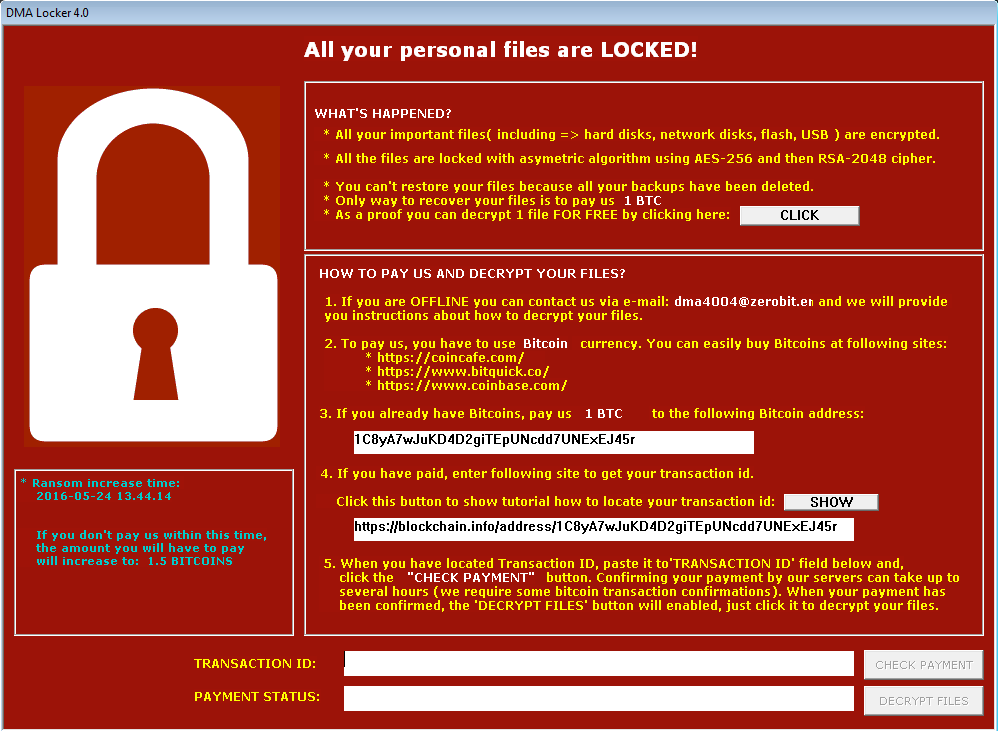

# Exercise 3-1: Standard Operating Procedure

In this exercise, you will write an SOP that describes how to respond to the risk event of a "ransomware disruption at Meditech Hospital”

### Target Context

- The operations center has noticed an unusual spike in database activity and discover the hospital is experiencing a ransomware attack
- The center has a series of independent databases that support different departments.
- Critical databases support
  - Patient medical information and records
  - Billing and hospital administration
  - Staff scheduling and human resources
  - Hospital operations - power, water, etc
  - Medical slating - surgery scheduling and patient care scheduling
- There is also a database that contains all the configuration and operations information used by the hospital data center which includes configuration management databases

- In addition to the databases, the data center has a document repository that contains a collection of documents in a records management system. These include
  - Legal documents like patient releases for examples
  - Medical reference and procedure reference materials
  - Patient histories and related care documents
  - Staff assessments and evaluations
  - Operations manuals
  - Audit reports for governance requirements
  - Reports to regulatory agencies

- The data center also maintains a separate repository for IT operations that contains
  - Documentation for all running hardware and software
  - Risk registers and SOPs statements
  - Logs and incident reports

- ALl the data is backed up on a nightly basis 
  - A full copy is created and stored in an AWS S3 bucket
  - Changes to the data are captured in real time in a transaction journal which is mirrored in an AWS DynamoDB database in real time
- The records management files are backed up in an AWS S3 bucked and are incrementally backed up at the end of each day

- The network has four subnets
  - MediNet: The bank internal network that connects all medical operations and supporting services
  - HospNet: The public facing internet which provides public access to hospital information and services
  - OpsNet: Internal network used by non-medical departments (eg. maintenance, catering, housekeeping)
  - SysNet: Internal network used by IT for operations and monitoring

### SOP Template

- Propose realistic content for each section

#### Title	
- What is the name of this SOP? (e.g., SOP: Emergency Power Failure Response)

#### Purpose	
- Why does this SOP exist? What risk or activity does it address?

#### Scope
- Who and what does this SOP apply to? (e.g., departments, sites, teams)

#### Roles & Responsibilities	
- Who does what during this procedure? 
- Identify key roles.

#### Required Materials/Resources	
- What tools, systems, or information are needed to perform it?

#### Procedure Steps	
- Clear, numbered steps describing what must be done, in sequence. 
- Each step should start with an action verb.

#### Safety / Risk Considerations	
- What hazards or failure points exist, and how should they be mitigated?

#### Communication / Reporting	
- Who should be informed or notified? What reports or logs are required?

#### References / Linked Documents	
- What other documents, plans, or policies support this SOP?

#### Review and Update	
- Who maintains this SOP, and how often is it reviewed?

## Evaluation

Review what you have done using the following criteria

#### Clarity	
- Are the steps easy to follow for someone new?

#### Completeness	
- Are all necessary roles, resources, and steps included?

#### Practicality	
- Could the SOP be used in a real situation without confusion?

#### Tone & Format	
- Does it look professional and consistent?

#### Risk Awareness	
- Does it acknowledge and manage relevant risks?

